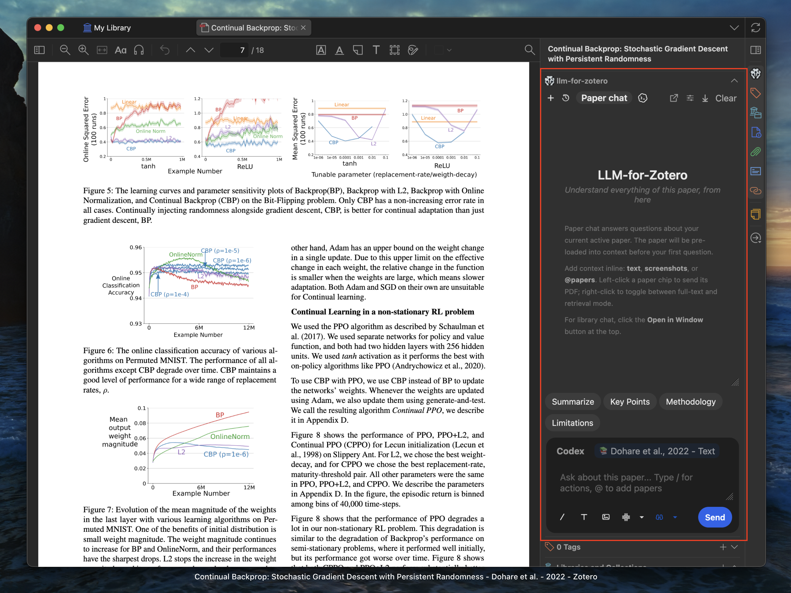
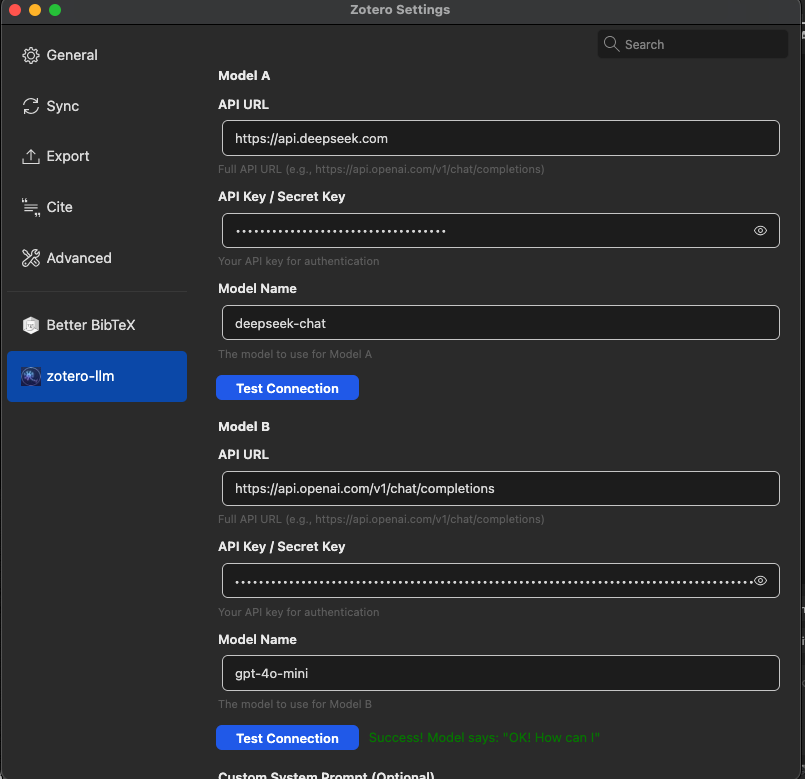

# Zotero-LLM: Your Right-Hand Side AI Research Assistant

## 🗓️ 02.06.2026 Update
Zotero-LLM v3.0 [release](https://github.com/yilewang/zotero-llm/releases) is now support mainstream reasoning models, including `gpt-5.x` series from OpenAI, `gemini-3-pro-preview`, `gemini-2.5-flash` from Google, `deepseek-chat` and `deepseek-reasoner` from Deepseek, and `kimi-k2.5` series from Moonshot. You can easily connect to these models with your own API key and enjoy the power of LLMs while reading papers in Zotero.

UI has been redesigned to be more intuitive and elegant. You can also customize the quick-action presets to fit your specific research needs.

## Introduction
**Zotero-LLM** is a powerful plugin for [Zotero](https://www.zotero.org/) that integrates Large Language Models (LLMs) directly into the Zotero PDF reader. Unlike other tools that require you to upload your pdfs to a portal, this plugin is designed to conveniently access LLMs without the need to leave Zotero. It quietly sits in the panel of the Zotero reader, like your standby research assistant, ready to help you with any questions you have when reading a paper.

<!--  -->

Key Features

- 🎨 Simple and elegant interface: Keep your attention on the paper rather than the tool.

- 🔑 Bring Your Own Key (BYOK): Connect directly to your preferred LLM provider. You pay only for what you use, with no middleman subscription fees. You can set up up to 2 LLM models to help me handle different types of tasks: for instance, the multimodal model for helping you to interpret the Figure; text-based model for helping you understand text. 

- Image input supported: You can do screenshot on the Figure and ask model for details. 

- 💬 Context-Aware Chat: Have a natural conversation with your PDF. The model has context of the paper currently open in your reader.

- ⚡ Quick-Action Presets: Use built-in prompts to instantly generate:
  - Summaries

  - Key Points (bulleted lists)

  - Methodology breakdowns

  - Limitations & Future Work analysis

  - All shortcuts are customizable.

- Support for mainstream LLM providers: OpenAI, Google Gemini, Deepseek, Moonshot and any provider with a compatible API.

### Installation

#### Step 1: Download the latest `.xpi` release

Download the latest `.xpi` release from the [Releases Page](https://github.com/yilewang/zotero-llm/releases).

Open `Zotero` and go to `Tools -> Add-ons`.

#### Step 2: Install the `.xpi` file

Click the gear icon and select `Install Add-on From File`

#### Step 3: Restart `Zotero`

Select the `.xpi` file and restart `Zotero` to complete the installation.

### Configuration

Open `Preferences` and navigate to the `Zotero-LLM` tab.

Select your Provider (e.g., OpenAI, Gemini, Deepseek).

Paste your API Base URL, secret key and model name.

I will give some popular model as example:

| API url | Model Name | Reasoning Level |
| --- | --- | --- |
| https://api.openai.com/v1/chat/completions | gpt-5.2 | default, medium, high, xhigh |
| https://api.openai.com/v1/responses | gpt-5.2 | default, medium, high, xhigh |
| https://api.deepseek.com/v1/chat/completions | deepseek-chat | default |
| https://api.deepseek.com/v1/chat/completions | deepseek-reasoner | default |
|  https://generativelanguage.googleapis.com/v1beta/openai/chat/completions | gemini-3-pro-preview | low, high |
|  https://generativelanguage.googleapis.com/v1beta/openai/chat/completions | gemini-2.5-flash | medium |
| https://api.moonshot.ai/v1/chat/completions | kimi-k2.5 | default |

You can always check the connections by clicking the "Test Connection" button.

### Usage Guide

To chat with a paper, open any PDF in the Zotero reader.

Open the LLM Assistant sidebar (click the distinct icon in the right-hand toolbar).

Type a question in the chat box, such as "What is the main conclusion of this paper?"

### FAQ

> Q: Is it free to use?

A: Yes, absolutely free. You only pay for API calls, if you choose to use a paid API provider. If you think this tool is helpful, please consider supporting me with a star on GitHub or [buy me a coffee](https://buymeacoffee.com/yat.lok) .

> Q: Does this work with local models?

A: Actually, yes. As long as the local model provides an OpenAI compatible HTTP API that is compatible with the plugin, you can connect it by entering the appropriate API Base URL and secret key in the settings.

> Q: Is my data used to train models?

A: No. Since you use your own API key, your data privacy is governed by the terms of the API provider you choose (e.g., OpenAI Enterprise terms usually exclude training on API data).

> Q: If I have any questions, how to contact you?

A: Please feel free to open an issue on GitHub! I will try my best to help you.
