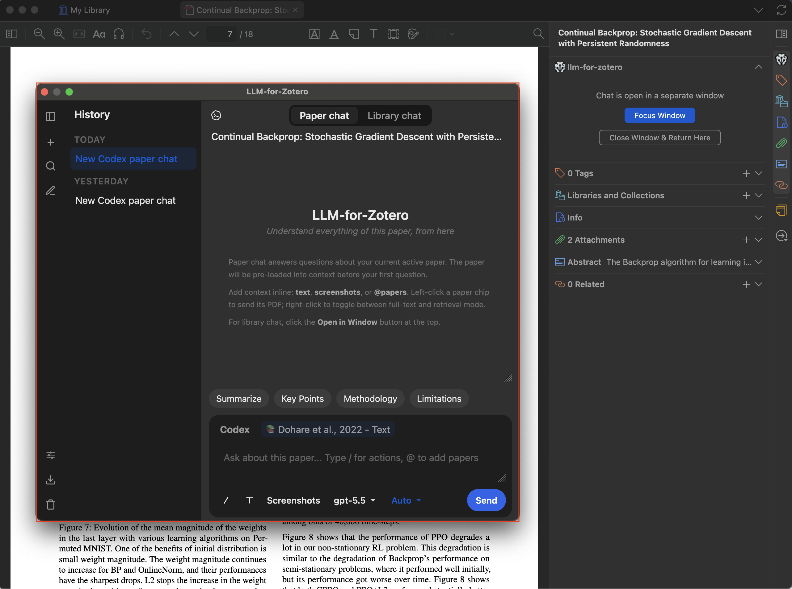
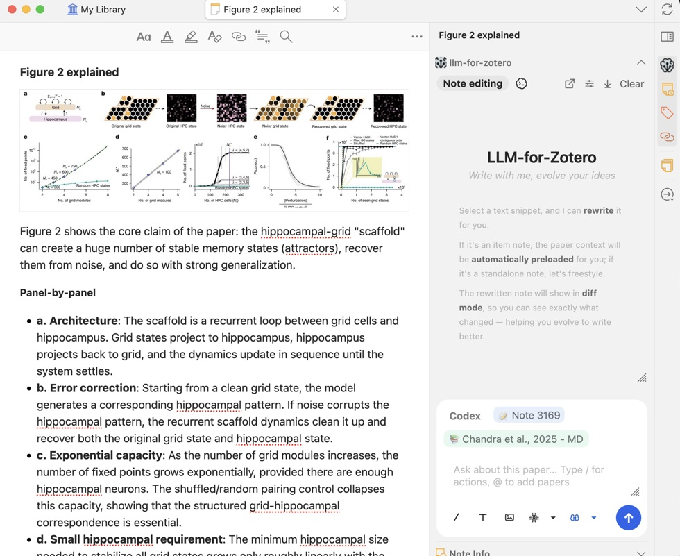
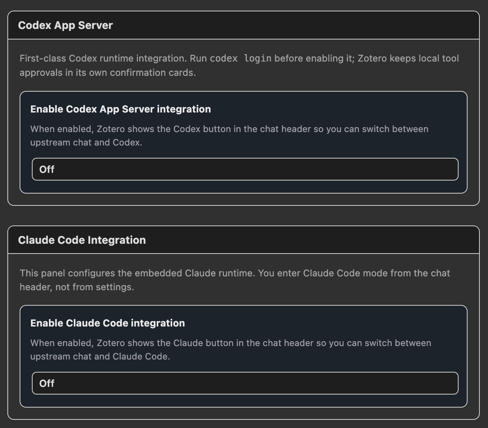
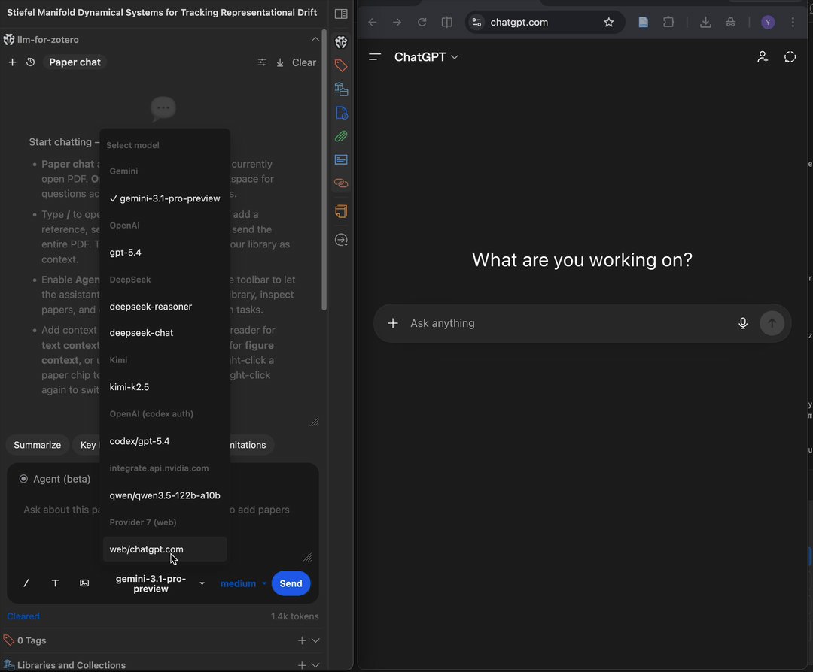

# llm-for-zotero: A Research Agent System for your Zotero Library

[](https://www.zotero.org)
[](https://www.zotero.org)
[](https://www.zotero.org)
[](https://github.com/windingwind/zotero-plugin-template)
[](https://www.gnu.org/licenses/agpl-3.0)
[](https://github.com/yilewang/llm-for-zotero/releases)
[](https://github.com/yilewang/llm-for-zotero/stargazers)
[](https://github.com/yilewang/llm-for-zotero/releases)
[](https://buymeacoffee.com/yat.lok)

<p align="center">
  
</p>

**llm-for-zotero** brings Large Language Models into the Zotero reader, so
you can ask questions, summarize papers, inspect figures, compare sources,
and save notes without leaving your library. It works with standard API
providers, local OpenAI-compatible models, WebChat, Codex App-Server,
and Claude Code.

Documentation:

- [English](https://yilewang.github.io/llm-for-zotero)
- [Chinese](https://yilewang.github.io/llm-for-zotero/zh/)

<p align="center">
  
</p>

<p align="center">
  
</p>

## Table of Contents

- [At a Glance](#at-a-glance)
- [Quick Start](#quick-start)
- [What's New](#whats-new)
- [Configuration](#configuration)
- [Demos](#demos)
- [File-Based Notes](#file-based-notes)
- [Agent Mode](#agent-mode-beta)
- [Skills](#skills)
- [WebChat Setup](#webchat-setup-chatgpt-web-sync)
- [Codex Setup](#codex-setup-chatgpt-plus-subscribers)
- [Claude Code Setup](#claude-code-setup-experimental)
- [MinerU PDF Parsing](#mineru-pdf-parsing)
- [Privacy and Data Flow](#privacy-and-data-flow)
- [Roadmap](#roadmap)
- [FAQ](#faq)
- [Contributing](#contributing)
- [Star History](#star-history)

## At a Glance

- Chat with the current PDF, selected text, figures, screenshots, and uploaded
  documents directly inside Zotero.
- Get grounded answers with citations that jump back to the source passage.
- Compare multiple open papers or add external files as extra context.
- Save answers, full conversations, and research notes to Zotero notes or local
  Markdown folders such as Obsidian and Logseq.
- Enable Agent Mode for library-wide read, search, tagging, metadata, import,
  note-editing, and organization workflows.
- Use your preferred backend: API keys, local models, ChatGPT WebChat, Codex App
  Server, or Claude Code.

<a id="installation"></a>
<a id="usage-guide"></a>

## What's New

- **Codex App Server** is the recommended Codex path for ChatGPT Plus users.
  It runs through the local `codex app-server` runtime and is configured from
  the **Agent** tab.
- **Claude Code Mode** runs Claude Code as a separate conversation system inside
  Zotero through a companion local bridge. It is experimental and does not yet
  support native Zotero API operations.
- **Skills** let you customize how Agent Mode handles research workflows. The
  plugin ships with 8 built-in skills and a portal for creating your own.
- **Standalone Window Mode** opens the assistant in a dedicated window with
  paper chat, library chat, and conversation history.
- **File-Based Notes** save Markdown notes to local folders, including Obsidian,
  Logseq, or any plain Markdown directory.
- **Cache-aware Agent Mode** preserves stable paper context, prior read
  evidence, and coverage state across longer research turns, then compacts old
  transcript history automatically when the context window gets crowded.
- **Citation navigation** now keeps citation labels conservative until page
  locations are verified, while quote-based citations can jump back to the
  matching Zotero passage.
- **MinerU PDF parsing** provides higher-fidelity extraction for tables,
  equations, figures, and local `mineru-api` servers, with a richer file
  manager for bulk parsing, cache repair, sync packages, tags, and parsing
  filters.

Thanks to [@jianghao-zhang](https://github.com/jianghao-zhang) and
[@boltma](https://github.com/boltma) for major contributions to the Codex App
Server, Claude Code, and file upload workflows.

## Quick Start

1. Download the latest `.xpi` file from the
   [Releases page](https://github.com/yilewang/llm-for-zotero/releases).
2. In Zotero, open `Tools` -> `Add-ons` -> gear icon ->
   **Install Add-on From File**, then select the `.xpi`.
3. Restart Zotero.
4. Open `Preferences` -> `llm-for-zotero`, choose a provider, enter the base
   URL, key, and model, then click **Test Connection**.
5. Open a PDF in Zotero and click the LLM Assistant icon in the right-hand
   toolbar.

If you do not want to use a provider API key, start with
[WebChat](#webchat-setup-chatgpt-web-sync) or
[Codex App Server](#codex-setup-chatgpt-plus-subscribers).

## Configuration

Open `Preferences` -> `llm-for-zotero`.

1. Select your **Provider**.
2. Paste your **API Base URL**, **secret key**, and **model name**.
3. Click **Test Connection**.

<p align="center">
  
</p>

The plugin supports multiple provider protocols, including `responses_api`,
`openai_chat_compat`, `anthropic_messages`, and `gemini_native`.

You can configure multiple providers and models for different tasks, such as a
multimodal model for figures and a text model for summaries. The conversation
panel also supports model-specific reasoning levels and hyperparameters such as
`temperature` and `max_tokens_output`.

<a id="features"></a>

## Demos

### Grounded Paper Chat

On the first message, the model loads the current paper as context. Follow-up
questions use focused retrieval from the same paper, keeping conversations fast
and grounded.

<p align="center">
  
</p>

Click any generated citation to jump straight to the source passage in Zotero.

### Summaries and Selected Text

Summarize a full paper, focus on methodology or results, or select any paragraph
and ask the model to explain it.

<p align="center">
  
</p>

<p align="center">
  
</p>

The selected-text pop-up can add highlighted text to chat with one click. It can
also be disabled in settings.

### Figures and External Files

Take screenshots of figures, attach up to 10 screenshots, or upload local files
as additional context. Supported uploads include PDF, DOCX, PPTX, TXT, and Markdown.

<p align="center">
  
</p>

<p align="center">
  
</p>

### Multi-Paper Comparison

Open multiple papers in Zotero tabs and type `/` to cite another paper as
additional context.

<p align="center">
  
</p>

### Notes, History, and Presets

Save answers or selected text to Zotero notes, export full conversations in
Markdown, and customize quick-action presets for repeated research tasks.

<p align="center">
  
</p>

<p align="center">
  
</p>

<p align="center">
  
</p>

## File-Based Notes

Beyond Zotero's built-in notes, the agent can save Markdown research notes to
any local directory you choose. Point it at an
[Obsidian](https://obsidian.md/) vault, a [Logseq](https://logseq.com/) graph,
or a plain folder of `.md` files.

Open `Preferences` -> `llm-for-zotero` and scroll to the **Notes Directory**
section.

<p align="center">
  
</p>

| Setting                  | Description                                                          | Example              |
| ------------------------ | -------------------------------------------------------------------- | -------------------- |
| **Nickname**             | How you refer to this directory in chat                              | `Obsidian`, `Logseq` |
| **Notes Directory Path** | Absolute path to the root directory where notes are saved            | `/Users/me/MyVault`  |
| **Default Folder**       | Default subfolder for new notes                                      | `Logs`               |
| **Attachments Folder**   | Folder for copied figures and images, relative to the directory root | `Logs/imgs`          |

Ask the agent to write a note using the configured nickname, for example:
_"Summarize this paper and save it to Obsidian."_ The agent gathers paper
metadata, writes a Markdown note, adds YAML frontmatter, optionally copies
figures from MinerU-parsed PDFs, and saves the note under the configured folder.

Or if you want to keep notes inside Zotero, the agent can also write to internal item notes with the `write-note` skill. Just ask it to "save a note for this paper" without mentioning an external directory.

### Zotero Notes vs. File-Based Notes (both generated by the plugin)

<p align="center">
  
</p>

<p align="center">
  
</p>

Notes use [Pandoc citation syntax](https://pandoc.org/MANUAL.html#citations)
such as `[@citekey]`, which works with Obsidian Zotero Integration, Pandoc
plugins, and many Markdown readers.

> Note templates and figure-embedding rules live in the `write-note` skill.
> Open the **Standalone Window** -> **Skills** portal to edit them.

## Agent Mode (beta)

Agent Mode is disabled by default. Enable it in `Preferences`, then toggle
`Agent (beta)` in the context bar.

It can read and search your library, draft notes, update metadata or tags with
confirmation, and undo recent write actions in the same session.

When enabled, the LLM can act on your Zotero library with read tools, write
tools, confirmation cards, and session undo.

Long agent runs are cache-aware. The plugin keeps stable Zotero context and
previously read evidence separate from the changing chat transcript, tracks which
papers and passages have already been inspected, and automatically compacts old
turns when the model context fills up. This lets follow-up questions reuse
grounded evidence when it is still relevant, while still asking the agent to read
again when the needed source or coverage layer is missing.

| Tool area                | Examples                                                                                                                                          |
| ------------------------ | ------------------------------------------------------------------------------------------------------------------------------------------------- |
| Library and PDF reading  | Search items and collections, read metadata, read papers, search paper passages, render PDF pages, inspect attachments                            |
| Scholarly discovery      | Search CrossRef and Semantic Scholar for metadata, recommendations, references, and citations                                                     |
| Library writes           | Apply tags, update metadata, move items, manage collections, manage attachments, merge duplicates, trash items, import identifiers or local files |
| Notes                    | Edit the active Zotero note or create a new note in plain text, Markdown, or HTML                                                                 |
| Filesystem and scripting | Read/write allowed local files, run analysis commands, or execute Zotero JavaScript with write confirmations                                      |
| Safety                   | Undo the most recent write action in the conversation, with the last 10 entries kept per session                                                  |

The design philosophy is simple: read tools are unrestricted; write tools stay
reviewable and undoable.

### Agent Mode Demos

#### Multi-step workflow

<p align="center">
  
</p>

#### Find related papers

<p align="center">
  
</p>

#### Apply tags

<p align="center">
  
</p>

#### Write a note

<p align="center">
  
</p>

## Skills

Skills customize Agent Mode behavior for recurring research workflows such as
paper QA, evidence retrieval, figure analysis, paper comparison, literature
reviews, note writing, and cited-reference import.

<details>
<summary>Built-in skills and custom skill setup</summary>

<p align="center">
  
</p>

Skills are customizable guidance files that shape how Agent Mode approaches
different types of requests. When your message matches a skill's trigger
patterns, the skill's instructions are injected into the agent prompt.

> Skills require **Agent Mode**. They have no effect in standard chat mode.

Built-in skills:

| Skill                    | What it guides the agent to do                                      |
| ------------------------ | ------------------------------------------------------------------- |
| `simple-paper-qa`        | Answer general questions about a paper efficiently                  |
| `evidence-based-qa`      | Find specific methods, results, or evidence with targeted retrieval |
| `analyze-figures`        | Interpret figures and tables using MinerU-extracted images          |
| `compare-papers`         | Compare multiple papers using batched reads and focused retrieval   |
| `library-analysis`       | Summarize or analyze your entire library without context overflow   |
| `literature-review`      | Conduct a structured literature review                              |
| `write-note`             | Write Zotero notes or Markdown notes in configured local folders    |
| `import-cited-reference` | Import papers cited in the current PDF into Zotero                  |

To create a custom skill, open the **Standalone Window**, click the **Skills**
icon, choose **"+ New skill"**, edit the skill file, and save. Skills are stored
as Markdown files in `{ZoteroDataDir}/llm-for-zotero/skills/`.

</details>

## Codex Setup (ChatGPT Plus Subscribers)

If you have a ChatGPT Plus subscription, you can use Codex models in the plugin
without a separate API key by signing in through the Codex CLI.

New users should choose **Codex App Server** from the **Agent** tab. The older
**Codex Auth (Legacy)** path remains available for existing users, but is
planned for future deprecation after app-server validation.

<details>
<summary>Codex App Server setup and legacy Codex Auth</summary>

<p align="center">
  
</p>

### Codex App Server setup

1. Install the Codex CLI:

   ```bash
   npm install -g @openai/codex
   ```

   On macOS, you can also use `brew install --cask codex`. On Windows, install
   Codex from PowerShell or Command Prompt rather than WSL, so Zotero MCP can
   use the Windows-local loopback connection.

2. Log in:

   ```bash
   codex login
   ```

   Credentials are saved to `~/.codex/auth.json`.

3. In Zotero, open `Preferences` -> `llm-for-zotero` -> **Agent** tab.
4. Turn on **Enable Codex App Server integration**.
5. Choose the default model and reasoning level.
6. Click **Test connection**.
7. In the chat header, click **Codex** to switch into the Codex conversation
   system.

`Codex App Server` and `Claude Code` are mutually exclusive runtime modes in the
Agent tab. Disable one before enabling the other.

### Codex Auth (Legacy)

Existing users can keep the legacy direct backend configuration:

- Open the **AI Providers** tab.
- Choose **Auth Mode** -> `Codex Auth (Legacy)`.
- Keep API URL `https://chatgpt.com/backend-api/codex/responses`.
- Keep your Codex model name, for example `gpt-5.5`.

Legacy notes:

- Reads credentials from `~/.codex/auth.json` or `$CODEX_HOME/auth.json`.
- Automatically attempts token refresh on 401 responses.
- Embeddings are not supported in this legacy direct mode yet.
- Local PDF/reference text grounding and screenshot/image inputs are supported.
- The Responses `/files` upload plus `file_id` attachment flow is not supported
  yet.

</details>

## Claude Code Setup (Experimental)

Claude Code mode runs Claude Code as a separate conversation system inside
Zotero. It reuses the sidebar and standalone-window UI, but has separate
conversation history, scope state, model settings, permission semantics, slash
commands, and project skills.

> Claude Code mode currently does **not** support native Zotero API operations.
> Use built-in [Agent Mode](#agent-mode-beta) for native library tools such as
> reading item state, editing notes, tagging papers, updating metadata, or
> importing items.

<details>
<summary>Claude Code prerequisites, bridge setup, and project assets</summary>

Prerequisites:

- A working Claude Code CLI installation. Follow Anthropic's official
  [Claude Code installation](https://code.claude.com/docs/en/installation.md),
  [quickstart](https://code.claude.com/docs/en/quickstart.md), and
  [authentication](https://code.claude.com/docs/en/authentication.md) docs.
- The `claude` command must be on `PATH` and authenticated.
- Node.js and npm for the companion bridge adapter.

### 1. Install and verify Claude Code

Run:

```bash
claude
```

Complete any login or authentication prompts before continuing.

### 2. Start the Zotero Claude bridge

Claude Code mode depends on the companion bridge repo
[`cc-llm4zotero-adapter`](https://github.com/jianghao-zhang/cc-llm4zotero-adapter).

```bash
git clone https://github.com/jianghao-zhang/cc-llm4zotero-adapter.git
cd cc-llm4zotero-adapter
npm install
npm run build
npm run serve:bridge
```

Check that the bridge is alive:

```bash
curl -fsS http://127.0.0.1:19787/healthz
```

For macOS background use, install the LaunchAgent from the adapter repo:

```bash
./scripts/install-macos-daemon.sh
```

Useful bridge daemon commands:

```bash
npm run daemon:status
npm run daemon:start
npm run daemon:stop
npm run daemon:restart
npm run daemon:uninstall
```

If Claude Code mode stops responding, restart the bridge and re-check
`/healthz`. A passing `/healthz` check only proves that the adapter is running;
it does not prove that the underlying `claude` CLI is installed, authenticated,
or correctly configured.

### 3. Enable Claude Code inside Zotero

Open `Preferences` -> `llm-for-zotero` -> **Agent** tab.

| Setting                            | Recommended value                  |
| ---------------------------------- | ---------------------------------- |
| **Enable Claude Code integration** | `On`                               |
| **Bridge URL**                     | `http://127.0.0.1:19787`           |
| **Claude Config Source**           | `default - user + project + local` |
| **Permission Mode**                | `safe`                             |
| **Default Model**                  | `sonnet`                           |
| **Default Reasoning**              | `auto`                             |

Keep **Claude Config Source** on `default` unless you already understand Claude
Code settings layers. In `default`, Claude Code can use your normal user
settings plus Zotero-managed project and per-conversation local settings.
The other options are:

- `user-only`: only your machine-wide Claude settings.
- `zotero-only`: only Zotero-managed project and local settings.

After enabling the integration, click the **Claude Code** button in the chat
header to enter Claude Code mode.

### 4. Prepare Claude project skills and commands

Zotero creates a Claude runtime root under your home directory, usually shaped
like:

```text
~/Zotero/agent-runtime/profile-.../
```

Shared Claude project assets live in:

```text
CLAUDE.md
.claude/settings.json
.claude/skills/
.claude/commands/
```

Each Claude conversation also gets its own local `.claude` folder under the
runtime `scopes/` tree, so per-conversation overrides do not leak into other
chats.

The Zotero UI exposes `opus`, `sonnet`, and `haiku` as capability tiers. If you
route Claude Code through a compatible provider layer or proxy, configure that
in Claude Code itself; Zotero only selects the tier and forwards the request to
the bridge.

</details>

## MinerU PDF Parsing

**MinerU** is an advanced PDF parsing engine that extracts high-fidelity
Markdown from PDFs, preserving tables, equations, figures, and complex layouts
that standard text extraction often mangles.

When enabled, the plugin sends newly added PDF attachments to MinerU for parsing
and caches the result locally. Later interactions with that paper use the
MinerU-parsed content.

<p align="center">
  
</p>

### How to enable MinerU

1. Open `Preferences` -> `llm-for-zotero`.
2. Find the **MinerU** section and check **Enable MinerU**.
3. Keep cloud mode enabled, or check **Use local MinerU server** for local mode.
4. For cloud mode, optionally enter your own MinerU API key — see below.
5. For local mode, run a self-hosted `mineru-api` server and keep the default
   base URL (`http://127.0.0.1:8000`) unless your server uses a different
   address.
6. Add or import a PDF into your Zotero library. The plugin will automatically
   parse newly added PDF attachments with MinerU and cache the result for future conversations.

MinerU can start without an API key through the built-in API, but a personal key
is strongly recommended. The built-in API may no longer be supported after
June 1, 2026.

To get a free personal key:

1. Go to [mineru.net](https://mineru.net) and create an account.
2. Navigate to account settings and generate an API key.
3. In Zotero, paste the key into the **MinerU** section.
4. Click **Test Connection**.

When a personal key is provided, the plugin calls
`https://mineru.net/api/v4` directly.

### Using a local MinerU server

Local MinerU server support was contributed by
[@renyong18](https://github.com/renyong18) in
[PR #152](https://github.com/yilewang/llm-for-zotero/pull/152).

Local mode sends PDFs to a self-hosted `mineru-api` server through
`POST /file_parse` and stores the returned ZIP output in the same local cache
format as cloud parsing. The default base URL is `http://127.0.0.1:8000`.

**Prerequisites for local mode**:

1. Install MinerU and run `mineru-api` (see the
   [MinerU docs](https://github.com/opendatalab/MinerU) for installation).
2. Make sure required models are downloaded — `mineru-api` lazy-loads on first
   request, so the very first parse (or the first parse after switching backend)
   can take noticeably longer than steady state.

You can pick a `Backend` in the local section:

- `pipeline` (default) — general-purpose, multi-language, CPU-friendly.
- `vlm` — VLM-based, high accuracy on Chinese/English documents, requires GPU.
- `hybrid` — newer high-accuracy hybrid pipeline, multi-language, requires
  local compute.

The first parse after starting the local server, or after changing backend, can
be slow while MinerU loads or downloads models. `Test Connection` checks that
the server process responds at `/health`; it does not guarantee that all models
are warmed up.

With the default `127.0.0.1` address, PDFs stay on your machine. If you change
the base URL to a LAN or remote server, PDFs are sent to that server.

**Pause / cancel limitation**: `mineru-api` exposes no cancel or DELETE endpoint
(only `POST /file_parse`, `POST /tasks`, `GET /tasks/{id}`,
`GET /tasks/{id}/result`, `GET /health`). When you click Pause, the plugin stops
the queue and aborts the HTTP wait, but the parse already running on the server
keeps executing until it finishes — the GPU/CPU will not free up sooner. If you
need to abort immediately (for example to switch backend without waiting),
restart the `mineru-api` process yourself.

### Managing MinerU caches

The **MinerU** preferences tab includes a **Manage Files** panel for maintaining
parsed PDF caches:

- Browse cached and uncached PDFs by collection, tag, title, author, year, and
  added date.
- Start parsing all visible files, only filtered files, or selected files.
- Repair local MinerU caches and synced packages when metadata or files drift.
- Delete all, filtered, selected, or single-item caches from the manager.
- Use tag filters, including automatic Zotero tags, to choose which papers are
  included in bulk actions.

Advanced parsing filters can skip files before automatic or bulk parsing:

- **Skip files over N pages** controls the maximum page count used by Start All,
  Start Filtered, Start Selected, and auto-parse. The default is 100 pages.
- **Exclude PDFs by Filename** accepts comma-separated substrings, or regex
  patterns wrapped in `/slashes/`, for translated copies, supplements, or other
  files you do not want parsed automatically.

If **Sync MinerU cache with Zotero file sync** is enabled, the plugin can create
companion ZIP attachments containing `full.md`, `manifest.json`,
`content_list.json`, and extracted assets. Existing local caches sync only when
you request it from the MinerU tab, and synced packages can restore a missing
local cache when needed.

<a id="webchat-setup-chatgpt-web-sync"></a>

## WebChat Setup (ChatGPT & Deepseek Web Sync)

WebChat mode sends questions to [chatgpt.com](https://chatgpt.com) and [deepseek.com](https://chat.deepseek.com) through a
browser extension, then streams responses back into Zotero. It is useful when
you want ChatGPT/deepseek web access without a provider API key.

<p align="center">
  
</p>

Prerequisites:

- A ChatGPT account for `chatgpt.com` WebChat or a Deepseek account for `deepseek.com` WebChat.
- A Chromium-based browser such as Chrome.

Setup:

1. Download the latest `extension.zip` from
   [sync-for-zotero releases](https://github.com/yilewang/sync-for-zotero).
2. Unzip it.
3. Open `chrome://extensions`, enable **Developer Mode**, choose
   **Load unpacked**, and select the unzipped extension folder.
4. In Zotero, open `Preferences` -> `llm-for-zotero` and set
   **Auth Mode** -> `WebChat`.
5. ⚠️: Keep a ChatGPT tab open in your browser. A green dot in Zotero means the extension and ChatGPT tab are connected. Make sure the tab and Zotero stay in the same monitor. No minimization or backgrounding, or the connection may drop.

## Privacy and Data Flow

Data flow depends on the backend you choose. Local models and local MinerU can
keep processing on your machine; cloud providers, WebChat, Claude Code, Codex,
and cloud MinerU involve their respective services or companion runtimes.

<details>
<summary>Detailed backend data flow</summary>

- In standard provider mode, paper content and user messages are sent to the
  model provider you configure.
- In local-model mode, requests go to the local OpenAI-compatible endpoint you
  configure.
- In WebChat mode, requests are relayed through the browser extension to
  `chatgpt.com` or `chat.deepseek.com`.
- In cloud MinerU mode, newly added PDFs are sent to MinerU for parsing when
  parsing is enabled.
- In local MinerU mode, newly added PDFs are sent to the local or remote
  `mineru-api` server you configure.
- Conversation history and cached paper context are stored locally by the
  plugin.
- Agent Mode write operations are routed through reviewable actions and session
  undo where supported.

</details>

## Roadmap

- [x] Agent mode (beta)
- [x] MinerU PDF parsing
- [x] GitHub Copilot auth
- [x] WebChat mode (ChatGPT web sync)
- [x] Standalone window mode
- [x] File-based notes (Obsidian, Logseq, any Markdown directory)
- [x] Claude Code integration
- [x] Codex App Server integration
- [x] Local MinerU support
- [x] Customized skills
- [x] Cross-device synchronization (MinerU cache)
- [ ] Agent memory system

## FAQ

> **Q: Does it require an API key to use this plugin?**
>
> A: It depends on the backend you choose. The plugin supports multiple backends with different requirements:

| Goal                                                        | Recommended path                                                              | API key required?               |
| ----------------------------------------------------------- | ----------------------------------------------------------------------------- | ------------------------------- |
| Use OpenAI, Gemini, DeepSeek, Moonshot, or another provider | Configure an API provider in Zotero preferences                               | Yes                             |
| Use a local model                                           | Connect any OpenAI-compatible local HTTP API                                  | Usually no                      |
| Use ChatGPT in the browser                                  | [WebChat](#webchat-setup-chatgpt-web-sync) with the Sync for Zotero extension | No                              |
| Use Codex models with ChatGPT Plus                          | [Codex App Server](#codex-setup-chatgpt-plus-subscribers)                     | No separate API key             |
| Use Claude Code inside Zotero                               | [Claude Code bridge](#claude-code-setup-experimental)                         | Claude Code auth                |
| Improve PDF extraction for tables, equations, and figures   | [MinerU PDF parsing](#mineru-pdf-parsing)                                     | Personal MinerU key recommended |

> **Q: Is it free to use?**
>
> Yes, the plugin is free. You only pay for API calls if you choose a paid
> provider. With Codex App Server, ChatGPT Plus subscribers can use Codex models
> without a separate API key. If you find this helpful, consider leaving a star
> on GitHub or [buying me a coffee](https://buymeacoffee.com/yat.lok).

<p align="center">
  
</p>

> **Q: Is my data used to train models?**
>
> The plugin does not train models. Data handling depends on the backend you
> choose: your configured API provider, local model, WebChat, Codex, Claude
> Code, or MinerU.

> **Q: How do I report a bug or ask a question?**
>
> Please [open an issue](https://github.com/yilewang/llm-for-zotero/issues) on
> GitHub.

## Contributing

Contributions are welcome. Bug reports, feature requests, documentation
improvements, and pull requests are all useful. Please
[open an issue](https://github.com/yilewang/llm-for-zotero/issues) or submit a
PR.

## Star History

[](https://www.star-history.com/?repos=yilewang%2Fllm-for-zotero&type=date&legend=top-left)
