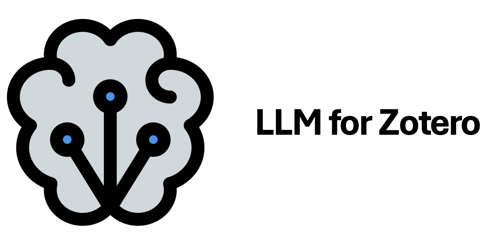
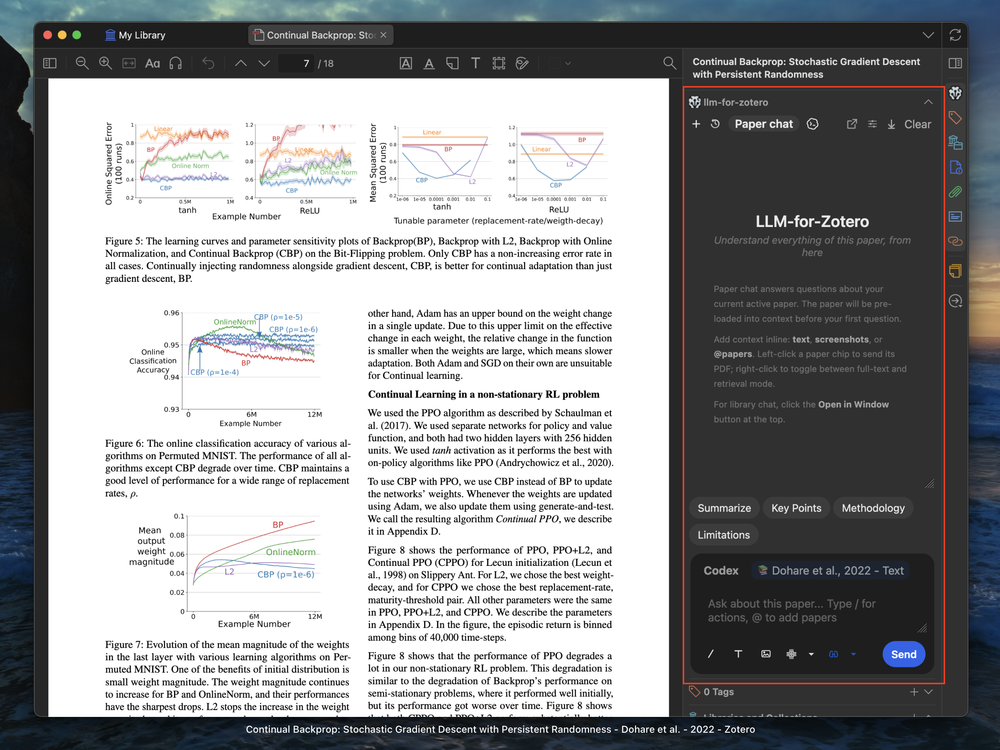
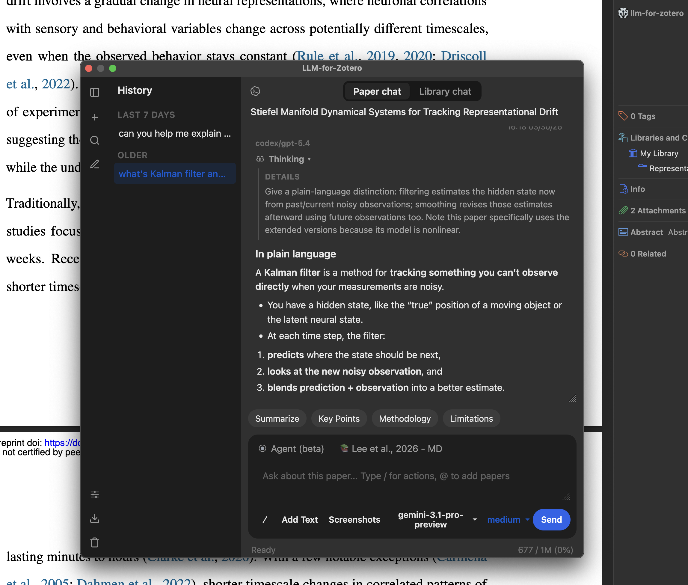
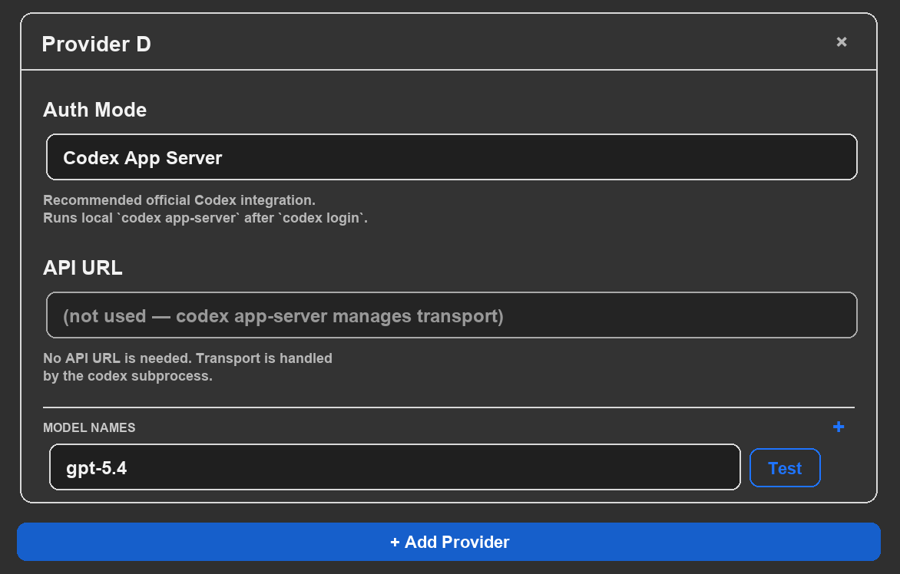
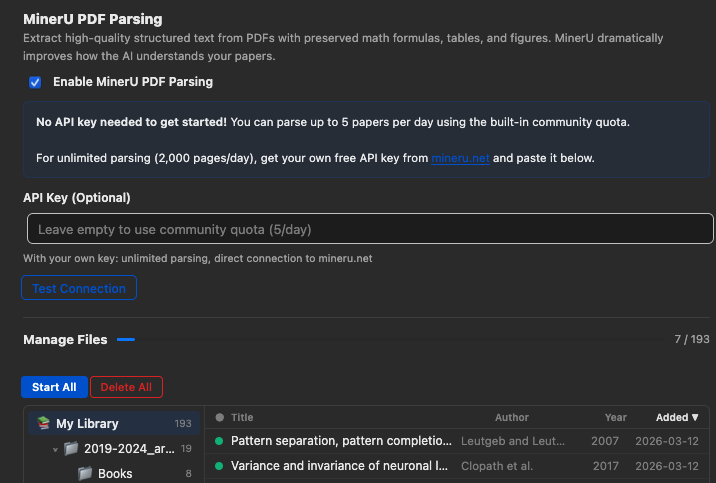

# llm-for-zotero: Your Right-Hand Side AI Research Assistant

[](https://www.zotero.org)
[](https://www.zotero.org)
[](https://www.zotero.org)
[](https://github.com/windingwind/zotero-plugin-template)
[](https://www.gnu.org/licenses/agpl-3.0)
[](https://github.com/yilewang/llm-for-zotero/releases)
[](https://github.com/yilewang/llm-for-zotero/stargazers)
[](https://github.com/yilewang/llm-for-zotero/releases)

<p align="center">
  
</p>

**llm-for-zotero** is a plugin for [Zotero](https://www.zotero.org/) that integrates Large Language Models directly into the Zotero PDF reader. Unlike tools that require uploading PDFs to a web portal, this plugin lets you chat with your papers without leaving Zotero. It sits quietly in the reader sidebar — your standby research assistant, ready whenever you need it.

Documentation:

- [English](https://yilewang.github.io/llm-for-zotero)
- [Chinese](https://yilewang.github.io/llm-for-zotero/zh/)

<p align="center">
  
</p>

<p align="center">
  
</p>

### 📢 Recent Updates

- **Skills** — Customizable guidance files that shape how the agent handles different tasks. 8 built-in skills included, plus a portal for creating your own. See [Skills](#skills).
- **Standalone Window Mode** — Open the LLM Assistant in its own dedicated window, separate from the Zotero reader sidebar. See [Standalone Window Mode](#standalone-window-mode).
- **File-Based Notes** — Save research notes as Markdown files in any local directory — works with Obsidian, Logseq, or any plain markdown folder. See [File-Based Notes](#file-based-notes).
- **Agent Mode (beta)** — LLM-for-Zotero can now act as an autonomous agent inside your Zotero library. See [Agent Mode](#agent-mode-beta) for details.
- **Codex auth** — ChatGPT Plus subscribers can use their Codex quota to access Codex models (e.g. `gpt-5.4`) without an API key. See [Codex Auth Setup](#codex-auth-setup-chatgpt-plus-subscribers).
- **MinerU PDF parsing** — High-fidelity PDF extraction that preserves tables, equations, and figures. See [MinerU PDF Parsing](#mineru-pdf-parsing).

---

## Table of Contents

- [Installation](#installation)
- [Configuration](#configuration)
- [Usage Guide](#usage-guide)
- [Features](#features)
- [File-Based Notes](#file-based-notes)
- [Agent Mode (beta)](#agent-mode-beta)
- [Skills](#skills)
- [WebChat Setup](#webchat-setup-chatgpt-web-sync)
- [Codex Auth Setup](#codex-auth-setup-chatgpt-plus-subscribers)
- [MinerU PDF Parsing](#mineru-pdf-parsing)
- [Roadmap](#roadmap)
- [FAQ](#faq)
- [Contributing](#contributing)
- [Star History](#star-history)

---

## Installation

### Step 1 — Download the latest `.xpi` release

Download the latest `.xpi` file from the [Releases Page](https://github.com/yilewang/llm-for-zotero/releases).

### Step 2 — Install the add-on

Open Zotero → `Tools` → `Add-ons` → click the gear icon → **Install Add-on From File** → select the `.xpi` file.

### Step 3 — Restart Zotero

Restart Zotero to complete the installation. The plugin will automatically check for future updates when Zotero starts.

---

## Configuration

Open `Preferences` → navigate to the `llm-for-zotero` tab.

1. Select your **Provider** (e.g. OpenAI, Gemini, Deepseek).
2. Paste your **API Base URL**, **secret key**, and **model name**.
3. Click **Test Connection** to verify.

<p align="center">
  
</p>

The plugin natively supports multiple provider protocols: `responses_api`, `openai_chat_compat`, `anthropic_messages`, `gemini_native`, and more.

### Supported Models (examples)

| API URL                                     | Model                | Reasoning Levels                  | Notes                 |
| ------------------------------------------- | -------------------- | --------------------------------- | --------------------- |
| `https://api.openai.com/v1/responses`       | gpt-5.4              | default, low, medium, high, xhigh | PDF uploads supported |
| `https://api.openai.com/v1/responses`       | gpt-5.4-pro          | medium, high, xhigh               | PDF uploads supported |
| `https://api.deepseek.com/v1`               | deepseek-chat        | default                           |                       |
| `https://api.deepseek.com/v1`               | deepseek-reasoner    | default                           |                       |
| `https://generativelanguage.googleapis.com` | gemini-3-pro-preview | low, high                         |                       |
| `https://generativelanguage.googleapis.com` | gemini-2.5-flash     | medium                            |                       |
| `https://generativelanguage.googleapis.com` | gemini-2.5-pro       | default, low, high                |                       |
| `https://api.moonshot.ai/v1`                | kimi-k2.5            | default                           |                       |

You can also set up **multiple providers**, each with multiple models for different tasks (e.g. a multimodal model for figures, a text model for summaries). Cross-check answers across models for more comprehensive understanding.

### Advanced: Reasoning Levels & Hyperparameters

You can set different reasoning levels per model in the conversation panel (e.g. "default", "low", "medium", "high", "xhigh") depending on model support. Power users can also adjust hyperparameters like `temperature`, `max_tokens_output`, etc. for more creative or deterministic responses.

---

## Usage Guide

1. **Open any PDF** in the Zotero reader.
2. **Click the LLM Assistant icon** in the right-hand toolbar to open the sidebar.
3. **Type a question** such as _"What is the main conclusion of this paper?"_

On the first message, the model loads the full paper content as context. Follow-up questions use focused retrieval from the same paper, so the conversation stays fast and relevant.

---

## Features

### Grounded Answers with One-Click Source Navigation

<p align="center">
  
</p>

When you ask a question, the model generates answers grounded in the paper's content. Click any citation to jump straight to the source passage in your Zotero library.

### Paper Summarization

<p align="center">
  
</p>

Get a concise summary of any paper in seconds. The summary is generated from the full text of the open PDF, and you can customize the prompt (e.g. focus on methodology, results, or implications).

### Selected Text Explanation

<p align="center">
  
</p>

Select any complex paragraph or technical term and ask the model to explain it. You can add up to 5 pieces of context from the model's answer or the paper to refine the explanation.

An optional pop-up lets you add selected text to the chat with one click. Don't like it? Disable it in settings — your choice.

### Figure Interpretation

<p align="center">
  
</p>

Take a screenshot of any figure and ask the model to interpret it. Supports up to 10 screenshots at a time.

### Cross-Paper Comparison

<p align="center">
  
</p>

Open multiple papers in different tabs and compare them side by side. Type `/` to cite another paper as additional context.

### External Document Upload

<p align="center">
  
</p>

Upload documents from your local drive as additional context — supports PDF, DOCX, PPTX, TXT, and Markdown files. _(Feature by [@jianghao-zhang](https://github.com/jianghao-zhang).)_

### Save to Notes

<p align="center">
  
</p>

Save any answer or selected text to your Zotero notes with one click — seamless integration with your note-taking workflow.

### Conversation History & Export

<p align="center">
  
</p>

Local conversation history is automatically saved and associated with the paper you're reading. Export entire conversations to Zotero notes in Markdown format — including selected text, screenshots, and properly rendered math equations.

### Custom Quick-Action Presets

<p align="center">
  
</p>

Customize quick-action presets to match your research workflow — predefined prompts available at the tap of a button.

---

## Standalone Window Mode

<p align="center">
  
</p>

Open the LLM Assistant in its own dedicated window, separate from the Zotero reader sidebar. The standalone window gives you a full-sized chat interface with a collapsible conversation history panel on the left.

- **Keyboard shortcut:** `Ctrl+Shift+L` (macOS: `Cmd+Shift+L`)
- **Paper chat & Library chat:** Switch between paper-specific and library-wide conversations using the tabs at the top.
- **Conversation history:** Browse past conversations organized by date (Today, Yesterday, Last 7/30 days, Older) in the left sidebar.
- **All features available:** Everything you can do in the reader sidebar — screenshots, file uploads, agent mode, quick-action presets — works identically in the standalone window.

While the standalone window is open, the reader sidebar panels display a placeholder with options to focus the window or close it and return to the sidebar.

---

## File-Based Notes

Beyond Zotero's built-in notes, the agent can save research notes as Markdown files in any local directory you choose. The plugin is **not tied to any specific note-taking app** — point it at an [Obsidian](https://obsidian.md/) vault, a [Logseq](https://logseq.com/) graph, or a plain folder of `.md` files, and the agent will write notes there with full metadata, citations, and optionally extracted figures.

### Configuration

Open `Preferences` → `llm-for-zotero` and scroll to the **Notes Directory** section.

<p align="center">
  
</p>

| Setting                  | Description                                                                                      | Example                |
| ------------------------ | ------------------------------------------------------------------------------------------------ | ---------------------- |
| **Nickname**             | How you refer to this directory in chat — the agent recognizes the name when you mention it      | `Obsidian`, `Logseq`   |
| **Notes Directory Path** | Absolute path to the root directory where notes are saved                                        | `/Users/me/MyVault`    |
| **Default Folder**       | Default subfolder for new notes (the agent can write to a different folder if you ask it to)     | `Logs`                 |
| **Attachments Folder**   | Folder for copied figures and images, **relative to the directory root**                         | `Logs/imgs`            |

Click **Test Write Access** to verify the plugin can write to your directory.

### How it works

Ask the agent to write a note using the nickname you configured — e.g. _"Summarize this paper and save it to Obsidian"_ or _"Log this to my Logseq"_. The agent will:

1. Gather content from the paper (metadata, summary, key points, figures, etc.).
2. Compose a Markdown note following the conventions of the `write-note` skill.
3. Add YAML frontmatter that matches the `write-note` template (`title`, `created`, `tags`, `citekey`, `doi`, `journal`); author information is kept in the note body, not frontmatter.
4. Optionally copy figures from MinerU-parsed PDFs into the attachments folder.
5. Write the note to `{notes_directory}/{default_folder}/{title}.md`.

<p align="center">
  
</p>

Notes use [Pandoc citation syntax](https://pandoc.org/MANUAL.html#citations) (`[@citekey]`), compatible with Obsidian's Zotero Integration and Pandoc plugins, as well as most other Markdown readers.

> **Customizing the note format:** Note templates and figure-embedding rules live in the `write-note` skill, not in preferences. Open the **Standalone Window** → **Skills** portal to edit it — see the [Skills](#skills) section for details.

---

## Agent Mode (beta)

> Agent Mode is disabled by default. Enable it in Preferences, then toggle `Agent (beta)` in the context bar.

When enabled, the LLM becomes an autonomous agent that can read, search, and write within your Zotero library.

### Available Tools

The agent ships with focused tools split into **read** (no confirmation needed) and **write** (route through a confirmation card with batched undo).

#### Library & PDF reading

| Tool                       | Description                                                                                                       |
| -------------------------- | ----------------------------------------------------------------------------------------------------------------- |
| `query_library`            | Discover Zotero items and collections — search/list any item type, filter by author/year/collection/itemType, browse the collection tree, find related papers, detect duplicates |
| `read_library`             | Read structured item state for one or more items — metadata, notes, annotations, attachments, collection membership |
| `read_paper`               | Read text content from a PDF — opening sections by default, or specific section indexes (up to 20 papers per call) |
| `search_paper`             | Find specific evidence in papers via a question — returns ranked relevant passages (up to 10 papers per call)     |
| `view_pdf_pages`           | Render PDF pages as images for visual analysis — by question, by page number, or capture the currently visible page |
| `read_attachment`          | Read any Zotero attachment by ID (HTML snapshots, text files, images), or send the whole file to the model        |
| `search_literature_online` | Search live scholarly sources (CrossRef, Semantic Scholar) for metadata, recommendations, references, citations   |

#### Library writes

| Tool                  | Description                                                                                  |
| --------------------- | -------------------------------------------------------------------------------------------- |
| `apply_tags`          | Add or remove tags on one or more papers                                                     |
| `update_metadata`     | Update metadata fields (title, authors, DOI, etc.) on an item                                |
| `move_to_collection`  | Add or remove papers from collections                                                        |
| `manage_collections`  | Create or delete collections (folders)                                                       |
| `manage_attachments`  | Delete, rename, or re-link broken attachment file paths                                      |
| `merge_items`         | Merge duplicates — keeps the master, moves children from the others, trashes the rest        |
| `trash_items`         | Move items to the trash                                                                      |
| `import_identifiers`  | Import papers by DOI, ISBN, arXiv ID, or URL                                                 |
| `import_local_files`  | Import local files (PDFs, etc.) — Zotero auto-fetches metadata for recognized PDFs           |
| `edit_current_note`   | Edit the active Zotero note or create a new one (plain text, Markdown, or HTML)              |

#### Filesystem & scripting

| Tool             | Description                                                                                              |
| ---------------- | -------------------------------------------------------------------------------------------------------- |
| `file_io`        | Read or write files on the local filesystem — text and image, with offset/length for partial reads       |
| `run_command`    | Run a shell command (zsh on macOS, bash on Linux, cmd.exe on Windows) — for analysis scripts and CLI tools |
| `zotero_script`  | Execute JavaScript inside Zotero's runtime — read mode for bulk data, write mode for custom mutations    |

#### Safety net

| Tool               | Description                                                                                            |
| ------------------ | ------------------------------------------------------------------------------------------------------ |
| `undo_last_action` | Undo the most recent write action in this conversation — keeps the last 10 entries per session         |

The design philosophy is **read tools are unrestricted; write tools always confirm and stay undoable**. Ask the agent what it can do — it will tell you.

### Demos

#### Multi-step workflow

<p align="center">
  
</p>

#### Read a figure directly

<p align="center">
  
</p>

#### Read multiple pages

<p align="center">
  
</p>

#### Find related papers

<p align="center">
  
</p>

#### Apply tags

<p align="center">
  
</p>

#### Write a note

<p align="center">
  
</p>

This is the first step for Agent Mode. The goal is a versatile agent that masters all tasks in your Zotero library.

---

## Skills

<p align="center">
  
</p>

Skills are customizable guidance files that shape how the agent approaches different types of requests. When your message matches a skill's trigger patterns, the skill's instructions are automatically injected into the agent's prompt — guiding it to use the most efficient tools and workflows for the task.

> Skills require **Agent Mode** to be enabled. They have no effect in standard chat mode.

The plugin ships with **8 built-in skills** covering common research workflows:

| Skill | What it guides the agent to do |
| --- | --- |
| `simple-paper-qa` | Answer general questions about a paper efficiently (read once, answer immediately) |
| `evidence-based-qa` | Find specific methods, results, or evidence with targeted retrieval |
| `analyze-figures` | Interpret figures and tables using MinerU-extracted images |
| `compare-papers` | Compare multiple papers using batched reads and focused retrieval |
| `library-analysis` | Summarize or analyze your entire library without context overflow |
| `literature-review` | Conduct a structured literature review (discover, read, synthesize) |
| `write-note` | Write reading notes either as Zotero notes or as Markdown files in your notes directory (Obsidian, Logseq, plain folders) |
| `import-cited-reference` | Import papers cited in the current PDF into your Zotero library |

### Creating Custom Skills

1. Open the **Standalone Window** and click the **Skills icon** in the toolbar.
2. Click **"+ New skill"** to create a template.
3. Edit the `id`, regex `match` patterns, and instruction body in your text editor.
4. Save — the skill loads immediately, no restart needed.

Skills are stored as Markdown files in `{ZoteroDataDir}/llm-for-zotero/skills/`. Left-click any skill to edit it; right-click for *Show in file system* or *Delete*.

---

## WebChat Setup (ChatGPT Web Sync)

**WebChat mode** lets you send questions directly to [chatgpt.com](https://chatgpt.com) through a browser extension — no API key needed. Your queries are relayed from Zotero to the ChatGPT web interface, and responses are streamed back into the plugin.

<p align="center">
  
</p>

### Prerequisites

- A ChatGPT account (Free, Plus, or Team)
- A Chromium-based browser (Chrome, Edge, Brave, Arc, etc.)

### Step-by-step setup

1. **Download the browser extension:**
   - Go to [github.com/yilewang/sync-for-zotero](https://github.com/yilewang/sync-for-zotero) → **Releases**
   - Download the latest `extension.zip`
   - Unzip the file to a folder on your computer

2. **Install the extension (sideload):**
   - Open your browser and navigate to `chrome://extensions`
   - Enable **Developer Mode** (toggle in the top-right corner)
   - Click **Load unpacked** and select the unzipped extension folder
   - The "Sync for Zotero" extension should now appear in your extensions list

3. **Configure the plugin:**
   - Open Zotero → `Preferences` → `llm-for-zotero`
   - Set **Auth Mode** → `WebChat`
   - The model is automatically set to `chatgpt.com`

4. **Start chatting:**
   - Open a ChatGPT tab in your browser (keep it open while using WebChat)
   - Open a paper in Zotero — the plugin panel shows the "chatgpt.com" indicator with a connection dot
   - A green dot means connected; red means the extension or ChatGPT tab is not detected
   - Type a question and send — the plugin relays it to ChatGPT and streams the response back

### WebChat features

- **PDF attachment**: Right-click the paper chip to toggle PDF sending (purple = send, grey = skip)
- **Screenshots**: Use the camera button to attach figure screenshots to your message
- **Conversation history**: Click the clock icon to browse and load past ChatGPT conversations
- **Exit**: Click the "Exit" button to return to regular API mode

---

## Codex Auth Setup (ChatGPT Plus Subscribers)

If you have a ChatGPT Plus subscription, you can use **Codex auth** to access Codex models (e.g. `gpt-5.4`) without an API key. The plugin reuses your ChatGPT login via the Codex CLI — a great way to save on token costs.

_Special thanks to [@jianghao-zhang](https://github.com/jianghao-zhang) for contributions to this feature._

### Step-by-step setup

1. **Install the Codex CLI** (one-time):
   - **macOS:** Install [Node.js 18+](https://nodejs.org/) or `brew install node`, then:
     ```bash
     npm install -g @openai/codex
     ```
   - **macOS (Homebrew alternative):** `brew install --cask codex` (no Node.js needed).
   - **Windows/Linux:** Install [Node.js 18+](https://nodejs.org/), then `npm install -g @openai/codex`.

2. **Log in with your ChatGPT account:**

   ```bash
   codex login
   ```

   A browser window opens — sign in with your ChatGPT Plus account. Credentials are saved to `~/.codex/auth.json`.

3. **Configure the plugin** (Zotero → Preferences → llm-for-zotero):
   - **Auth Mode** → `codex auth`
   - **API URL** → `https://chatgpt.com/backend-api/codex/responses`
   - **Model** → a Codex model (e.g. `gpt-5.4`)
   - Click **Test Connection** to verify.

<p align="center">
  
</p>

### Codex Auth Technical Notes

- Reads local credentials from `~/.codex/auth.json` (or `$CODEX_HOME/auth.json`).
- Automatically attempts token refresh on 401 responses.
- Embeddings are not supported in codex auth mode yet.
- Local PDF/reference text grounding and screenshot/image inputs are supported.
- The Responses `/files` upload + `file_id` attachment flow is not supported yet.

---

## MinerU PDF Parsing

**MinerU** is an advanced PDF parsing engine that extracts high-fidelity Markdown from PDFs — preserving tables, equations, figures, and complex layouts that standard text extraction often mangles. When enabled, the plugin sends your PDF to the MinerU API for parsing and caches the result locally. All subsequent interactions with that paper use the MinerU-parsed content, giving the LLM much richer and more accurate context.

<p align="center">
  
</p>

### How to enable MinerU

1. Open Zotero → `Preferences` → `llm-for-zotero` tab.
2. Find the **MinerU** section and check **Enable MinerU**.
3. (Optional) Enter your own MinerU API key — see below.
4. Open any PDF and start chatting. The plugin will automatically parse the PDF with MinerU on first use and cache the result for future conversations.

### Using your own API key

The plugin provides a shared community proxy so MinerU works out of the box without an API key. However, the shared quota is limited. For heavier usage, you can apply for your own key:

1. Go to [mineru.net](https://mineru.net) and create an account.
2. Navigate to your account settings and generate an API key.
3. In Zotero → `Preferences` → `llm-for-zotero` → **MinerU** section, paste your API key.
4. Click **Test Connection** to verify.

When a personal API key is provided, the plugin calls the MinerU API directly (`https://mineru.net/api/v4`). Without a key, it uses the community proxy.

---

## Roadmap

- [x] Agent mode (beta)
- [x] MinerU PDF parsing
- [x] GitHub Copilot auth
- [x] WebChat mode (ChatGPT web sync)
- [x] Standalone window mode ([#78](https://github.com/yilewang/llm-for-zotero/issues/78))
- [x] File-based notes (Obsidian, Logseq, any Markdown directory)
- [ ] Local MinerU support
- [x] Customized skills
- [ ] Cross-device synchronization

---

## FAQ

> **Q: Is it free to use?**
>
> Yes, absolutely free. You only pay for API calls if you choose a paid provider. With Codex auth, ChatGPT Plus subscribers can use Codex models without a separate API key. If you find this helpful, consider leaving a ⭐ on GitHub or [buying me a coffee](https://buymeacoffee.com/yat.lok).

<p align="center">
  
</p>

> **Q: Does it work with local models?**
>
> Yes — as long as the local model provides an OpenAI-compatible HTTP API, you can connect it by entering the appropriate API Base URL and key in settings.

> **Q: Is my data used to train models?**
>
> No. You use your own API key, so data privacy is governed by the terms of your chosen provider (e.g. OpenAI's API terms typically exclude training on API data).

> **Q: How do I report a bug or ask a question?**
>
> Please [open an issue](https://github.com/yilewang/llm-for-zotero/issues) on GitHub. I'll do my best to help!

---

## Contributing

Contributions are welcome! Whether it's bug reports, feature requests, or pull requests — feel free to [open an issue](https://github.com/yilewang/llm-for-zotero/issues) or submit a PR.

---

## Star History

[](https://www.star-history.com/?repos=yilewang%2Fllm-for-zotero&type=date&legend=top-left)
